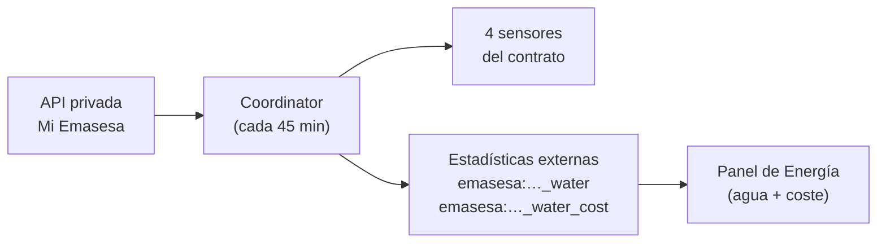

# EMASESA (Aguas de Sevilla) para Home Assistant

[](https://hacs.xyz/docs/faq/custom_repositories/)
[](https://www.home-assistant.io/)
[](LICENSE)
[](https://github.com/abrahamfa/ha-emasesa/actions/workflows/validate.yml)

Integración **no oficial** que trae a Home Assistant tu **consumo de agua de EMASESA**
(Empresa Metropolitana de Abastecimiento y Saneamiento de Aguas de Sevilla), leyendo la
misma API privada que usa la app **Mi Emasesa**.

Está pensada para contadores con **telelectura NB-IoT**, que reportan consumo **diario y
horario**, e importa todo el histórico horario al **panel de Energía** de Home Assistant,
incluido el **coste en euros** calculado con el **simulador oficial de tarifas** de EMASESA.

---

> [!WARNING]
> **Esto usa una API privada, no documentada y no oficial de EMASESA.**
>
> - No está **afiliada, avalada ni soportada por EMASESA**. Es un proyecto personal.
> - EMASESA puede **cambiar o cerrar su backend en cualquier momento y sin previo aviso**,
>   y entonces la integración dejará de funcionar hasta que alguien la adapte.
> - Se conecta **con tu propia cuenta** y solo descarga **tus propios datos de consumo**
>   (interoperabilidad con datos propios). No accede a datos de terceros.
> - Úsala bajo tu responsabilidad. Un uso abusivo (sondeos muy agresivos) puede provocar
>   que EMASESA bloquee tu cuenta: respeta el intervalo por defecto.

---

## Índice

- [Qué hace](#qué-hace)
- [Entidades que crea](#entidades-que-crea)
- [Estadísticas de largo plazo](#estadísticas-de-largo-plazo)
- [Requisitos](#requisitos)
- [Instalación](#instalación)
- [Configuración](#configuración)
- [Opciones](#opciones)
- [Panel de Energía](#panel-de-energía)
- [Notas importantes](#notas-importantes)
- [Ejemplos de automatización](#ejemplos-de-automatización)
- [En desarrollo](#en-desarrollo)
- [FAQ y solución de problemas](#faq-y-solución-de-problemas)
- [Cómo funciona por dentro](#cómo-funciona-por-dentro)
- [Contribuir](#contribuir)
- [Créditos](#créditos)
- [Licencia](#licencia)

---

## Qué hace

- **Lee el contador por telelectura**: índice acumulado, consumo del día y desglose
  diurno / nocturno.
- **Rellena el histórico horario** en las estadísticas de largo plazo de Home Assistant
  (unos **60 días** en el primer arranque; después mantiene los últimos días y **tapa
  huecos** si HA o la API han estado caídos).
- **Calcula el coste real** del periodo de facturación en curso llamando al
  **simulador oficial de EMASESA**, así que aplica **la tarifa de tu contrato**
  (cuota fija + tramos + saneamiento + depuración + canon autonómico + IVA) sin que la
  integración tenga que mantener tablas de precios.
- **Alimenta el panel de Energía** con dos estadísticas externas: **m³ consumidos** y
  **€ gastados**.
- **Configuración 100 % por interfaz**: sin YAML, con soporte de **doble factor (SMS)**,
  **reautenticación** y **selección de contrato** cuando tienes varios suministros.



## Entidades que crea

La integración crea **un dispositivo por contrato**, llamado `EMASESA <nº de contrato>`,
con el fabricante, modelo y número de serie reales del contador:

```
┌─ Dispositivo: EMASESA 12345678 ──────────────────────────────────┐
│  Fabricante: …     Modelo: …     Nº de serie: …                  │
│                                                                  │
│  Índice del contador ................... 1 284,317 m³            │
│  Consumo del día ....................... 312 L                   │
│  Coste del periodo ..................... 41,86 €                 │
│  Precio del agua ....................... 2,1934 €/m³             │
└──────────────────────────────────────────────────────────────────┘
```

| Entidad | `entity_id` de ejemplo | Unidad | `device_class` | `state_class` |
| --- | --- | --- | --- | --- |
| **Índice del contador** | `sensor.emasesa_12345678_indice_del_contador` | `m³` | `water` | `total_increasing` |
| **Consumo del día** | `sensor.emasesa_12345678_consumo_del_dia` | `L` | – | – (valor diario) |
| **Coste del periodo** | `sensor.emasesa_12345678_coste_del_periodo` | `EUR` | `monetary` | – |
| **Precio del agua** | `sensor.emasesa_12345678_precio_del_agua` | `EUR/m³` | – | `measurement` |

> El `entity_id` real se construye con el **número de contrato** que aparece en tu
> factura. Compruébalo en *Ajustes → Dispositivos y servicios → EMASESA*.

<details>
<summary><b>Atributos de cada sensor</b></summary>

**Índice del contador**

| Atributo | Descripción |
| --- | --- |
| `indice_litros` | Lectura acumulada del contador, en litros (valor crudo de la API) |
| `fecha_dato` | Fecha del último dato de consumo disponible |
| `fecha_lectura_contador` | Fecha de la última lectura reportada por el contador |
| `numero_serie`, `modelo` | Identificación del contador |
| `telelectura_nbiot` | Si el contador es NB-IoT |
| `estadistica_historica` | Id exacto de la estadística externa de consumo (útil para el panel de Energía) |

**Consumo del día**

| Atributo | Descripción |
| --- | --- |
| `fecha` | Día al que corresponde el consumo |
| `consumo_diurno_litros` | Litros consumidos en franja diurna |
| `consumo_nocturno_litros` | Litros consumidos en franja nocturna (**muy útil para detectar fugas**) |

**Coste del periodo**

| Atributo | Descripción |
| --- | --- |
| `consumo_periodo_m3` | m³ consumidos en el ciclo de facturación en curso |
| `precio_efectivo_eur_m3` | € por m³ resultante (coste ÷ consumo) |
| `periodo_desde` | Fecha de fin de la última factura, es decir, inicio del ciclo actual |
| `proxima_factura` | Fecha prevista de la próxima facturación |

</details>

**¿Por qué “Consumo del día” no tiene `state_class`?** Porque es un valor que sube y baja
de un día a otro; si el `recorder` intentara acumularlo como suma, el histórico saldría
mal. El histórico correcto lo aportan las estadísticas externas y el índice del contador.

**¿Por qué “Precio del agua” baja según consumes?** Porque reparte la **cuota fija** del
ciclo entre más m³. Es el precio *efectivo* del periodo, no una tarifa marginal.

## Estadísticas de largo plazo

Además de los sensores, la integración escribe dos **estadísticas externas** con detalle
**horario**, que son las que conviene usar en el panel de Energía:

| `statistic_id` | Unidad | Contenido |
| --- | --- | --- |
| `emasesa:<contrato>_water` | `m³` | Consumo acumulado del contador, hora a hora |
| `emasesa:<contrato>_water_cost` | `EUR` | Coste acumulado, hora a hora, al precio efectivo del ciclo |

> [!NOTE]
> `<contrato>` es el **identificador interno del contrato** que devuelve la API, que
> **no tiene por qué coincidir** con el número de contrato de tu factura. Si tienes dudas
> sobre el valor exacto, míralo en el atributo `estadistica_historica` del sensor
> *Índice del contador*, o búscalo en
> *Herramientas para desarrolladores → Estadísticas* escribiendo `EMASESA`.

La importación del consumo es **idempotente**: se basa en el índice absoluto del contador,
así que reimportar los mismos días no duplica consumo. El coste, en cambio, se acumula
**por incrementos** y nunca reescribe el pasado, porque el precio efectivo va cambiando
dentro del ciclo.

## Requisitos

| Requisito | Detalle |
| --- | --- |
| **Contador con telelectura NB-IoT** | Es lo que da el detalle **diario y horario**. EMASESA tiene ya telegestionado en torno al **80 % del parque de contadores**; si el tuyo aún es mecánico, la integración arrancará pero apenas tendrás datos. |
| **Cuenta de la Oficina Virtual / app Mi Emasesa** | Con acceso al contrato que quieras monitorizar. |
| **Home Assistant ≥ 2024.6** | Requerido por el config flow y la API de estadísticas que se usa. |
| **Integración `recorder` activa** | Es una dependencia declarada: sin ella no hay estadísticas de largo plazo ni panel de Energía. Viene activada de serie salvo que la hayas desactivado a mano. |

## Instalación

### Opción A — HACS (recomendada)

Este repositorio todavía no está en el índice por defecto de HACS, así que se añade como
**repositorio personalizado**:

1. Abre **HACS** en Home Assistant.
2. Menú **⋮** (arriba a la derecha) → **Repositorios personalizados**.
3. Pega la URL `https://github.com/abrahamfa/ha-emasesa` y elige la categoría
   **Integration**. Pulsa **Añadir**.
4. Busca **EMASESA (Aguas de Sevilla)** en HACS y pulsa **Descargar**.
5. **Reinicia** Home Assistant.

[](https://my.home-assistant.io/redirect/hacs_repository/?owner=abrahamfa&repository=ha-emasesa&category=integration)

### Opción B — Instalación manual

1. Descarga la última versión del repositorio.
2. Copia la carpeta `custom_components/emasesa/` dentro de la carpeta
   `config/custom_components/` de tu instalación, de forma que quede
   `config/custom_components/emasesa/manifest.json`.
3. **Reinicia** Home Assistant.

## Configuración

Todo se hace desde la interfaz; no hay nada que poner en `configuration.yaml`.

1. Ve a **Ajustes → Dispositivos y servicios → Añadir integración** y busca **EMASESA**.

   [](https://my.home-assistant.io/redirect/config_flow_start/?domain=emasesa)

2. **Usuario**: tu **NIF / DNI / NIE**, que es el identificador con el que entras en la
   Oficina Virtual (se normaliza a mayúsculas automáticamente).
   **Contraseña**: la misma de la Oficina Virtual / app Mi Emasesa.

3. **Doble factor (si tu cuenta lo tiene activado)**: EMASESA te enviará un **código por
   SMS** (o correo) y la integración te pedirá el **Código de verificación**.
   Al terminar, Home Assistant queda registrado como **dispositivo de confianza**, así que
   **no se te volverá a pedir** en cada actualización ni en cada reinicio.

4. **Selección de contrato**: si en tu cuenta hay varios puntos de suministro, elige cuál
   quieres monitorizar; se muestran como `nº de contrato — dirección de suministro`.
   Si solo hay uno, este paso se salta.

Puedes **repetir el proceso** para añadir más contratos: cada uno se crea como una entrada
independiente, con su propio dispositivo y sus propias estadísticas.

### Reautenticación

Si cambias la contraseña en la Oficina Virtual, o EMASESA invalida la sesión, Home
Assistant mostrará el aviso de **“Volver a autenticar”**. Introduce la contraseña nueva y,
si hace falta, el código SMS: el dispositivo se vuelve a registrar como de confianza
automáticamente.

## Opciones

En la tarjeta de la integración, **Configurar**:

| Opción | Clave | Por defecto | Rango |
| --- | --- | --- | --- |
| Intervalo de actualización (minutos) | `scan_minutes` | `45` | `15` – `1440` |

> [!TIP]
> No merece la pena bajarlo. El dato de telelectura se consolida como mucho cada hora y,
> encima, llega con **1–2 días de retraso**: sondear cada pocos minutos no te dará datos
> más frescos, solo carga innecesaria sobre la API de EMASESA.

## Panel de Energía

Ve a **Ajustes → Paneles → Energía**.

### 1. Consumo de agua

En la sección **Agua**, pulsa **Añadir consumo de agua** y selecciona la estadística:

```
emasesa:<contrato>_water        →  aparece como "EMASESA consumo <contrato>"
```

### 2. Coste

En el mismo diálogo, elige **“Usar una entidad con el coste total”** (*Use an entity
tracking the total costs*) y selecciona:

```
emasesa:<contrato>_water_cost   →  aparece como "EMASESA coste <contrato>"
```

Así el panel muestra los euros calculados con la tarifa real de tu contrato, en vez de
multiplicar por un precio fijo.

> [!CAUTION]
> **No añadas a la vez el sensor `Índice del contador` y la estadística
> `emasesa:<contrato>_water`.**
>
> Los dos representan **el mismo contador**, así que el panel de Energía **contaría el
> consumo dos veces**. Elige uno:
>
> - **Recomendado: la estadística externa** `emasesa:<contrato>_water`, porque trae el
>   detalle **horario** correcto y el histórico completo de los últimos ~60 días.
> - El sensor `Índice del contador` solo tiene sentido si prefieres que el panel se
>   alimente del estado en vivo; en ese caso, deja la estadística para tarjetas e
>   informes.
>
> Si ya lo habías añadido mal, quita la fuente duplicada en el panel de Energía y, si
> hiciera falta, borra las estadísticas sobrantes desde
> *Herramientas para desarrolladores → Estadísticas*.

## Notas importantes

- ⏳ **Los datos llegan con 1–2 días de retraso.** Así funciona la telelectura de EMASESA:
  el contador NB-IoT envía sus lecturas por lotes y el backend las consolida después. No
  esperes ver en Home Assistant la ducha que te acabas de dar. El sensor
  *Consumo del día* muestra el **último día disponible**, que no tiene por qué ser hoy.
- 💶 **El coste es una estimación**, no una factura. Lo calcula el **simulador oficial de
  EMASESA** con el consumo real de tu ciclo, así que aplica tu tarifa de verdad, pero
  puede diferir de la factura final por redondeos, regularizaciones, prorrateos,
  bonificaciones o cambios de tarifa a mitad de periodo. El simulador trabaja con m³
  enteros.
- 📅 En el **primer arranque** se importan unos **60 días** de histórico horario; el
  proceso tarda un poco y las estadísticas pueden no verse hasta pasados unos minutos.
- 🧭 Las horas se interpretan en **Europe/Madrid**, incluidos los cambios de hora
  (el día de 25 horas de octubre está contemplado).
- 🔐 Tus credenciales se guardan en el almacén de configuración de Home Assistant, como en
  cualquier otra integración, y solo se envían a EMASESA.

## Ejemplos de automatización

> Sustituye `12345678` por el número de tu contrato en los `entity_id`.

### Aviso de consumo diario alto

```yaml
automation:
  - alias: "Agua · Consumo diario alto"
    description: >-
      Avisa cuando el último día reportado por EMASESA supera los 500 litros.
    mode: single
    trigger:
      - platform: numeric_state
        entity_id: sensor.emasesa_12345678_consumo_del_dia
        above: 500
    action:
      - service: notify.persistent_notification
        data:
          title: "Consumo de agua alto"
          message: >-
            El {{ state_attr('sensor.emasesa_12345678_consumo_del_dia', 'fecha') }}
            se consumieron
            {{ states('sensor.emasesa_12345678_consumo_del_dia') }} L
            ({{ state_attr('sensor.emasesa_12345678_consumo_del_dia',
                           'consumo_nocturno_litros') }} L de noche).
```

### Aviso de posible fuga por caudal nocturno

Un consumo nocturno constante y apreciable, con la casa dormida, es el síntoma clásico de
una cisterna que pierde o de un goteo. Ajusta el umbral a tu vivienda: una cisterna con
fuga se va fácilmente por encima de 50 L por noche.

```yaml
automation:
  - alias: "Agua · Posible fuga (caudal nocturno)"
    description: >-
      Salta cuando llega un día nuevo de telelectura con consumo nocturno elevado.
    mode: single
    trigger:
      - platform: state
        entity_id: sensor.emasesa_12345678_consumo_del_dia
        attribute: fecha
    condition:
      - condition: template
        value_template: >-
          {{ state_attr('sensor.emasesa_12345678_consumo_del_dia',
                        'consumo_nocturno_litros') | float(0) > 50 }}
    action:
      - service: notify.persistent_notification
        data:
          title: "⚠️ Posible fuga de agua"
          message: >-
            La noche del
            {{ state_attr('sensor.emasesa_12345678_consumo_del_dia', 'fecha') }}
            se registraron
            {{ state_attr('sensor.emasesa_12345678_consumo_del_dia',
                          'consumo_nocturno_litros') }} L con la casa en reposo.
            Revisa cisternas, grifos y riego.
```

### Aviso cuando el gasto del ciclo pasa de un umbral

```yaml
automation:
  - alias: "Agua · Coste del periodo por encima de lo previsto"
    mode: single
    trigger:
      - platform: numeric_state
        entity_id: sensor.emasesa_12345678_coste_del_periodo
        above: 60
    action:
      - service: notify.persistent_notification
        data:
          title: "Factura de agua en camino"
          message: >-
            Llevas {{ states('sensor.emasesa_12345678_coste_del_periodo') }} € este ciclo
            ({{ state_attr('sensor.emasesa_12345678_coste_del_periodo',
                           'consumo_periodo_m3') }} m³).
            Próxima factura:
            {{ state_attr('sensor.emasesa_12345678_coste_del_periodo',
                          'proxima_factura') }}.
```

## En desarrollo

Estas funciones están **en construcción** y todavía no forman parte de una versión
publicada:

- Sensores de **última factura**, **deuda pendiente**, **consumo medio diario**,
  **días hasta la próxima factura** y **estado de los embalses** que abastecen a Sevilla.
- `binary_sensor` de **posible fuga por caudal nocturno**, **avería o lectura estimada
  forzada** e **incidencia de red cercana**.
- **Servicios** (`services.yaml`) y **diagnósticos** descargables (`diagnostics.py`).

Si te interesa alguna, comenta en el issue correspondiente antes de ponerte a ello.

## FAQ y solución de problemas

<details>
<summary><b>“Usuario o contraseña incorrectos”, pero mis credenciales son correctas</b></summary>

Este es el clásico. El servidor de EMASESA **filtra por `User-Agent`**: si la petición no
se identifica exactamente como la app oficial (`okhttp/2.1.0`), responde un **401 con un
mensaje falso de contraseña incorrecta**, aunque las credenciales sean perfectas.

**Ya está resuelto en la integración**: todas las llamadas usan las mismas cabeceras que la
app. Si aun así te sale el error:

1. Comprueba que puedes entrar en la [Oficina Virtual](https://www.emasesaonline.com/)
   con ese NIF/NIE y esa contraseña.
2. Usa el **NIF/DNI/NIE**, no el correo electrónico ni el número de contrato.
3. Escribe el NIF **sin espacios ni guiones**; la letra da igual, se pasa a mayúsculas.
4. Si has fallado varias veces seguidas, EMASESA puede haber bloqueado temporalmente la
   cuenta: entra en la web y desbloquéala.

</details>

<details>
<summary><b>Me vuelve a pedir el código SMS una y otra vez</b></summary>

Tras el primer login, la integración registra Home Assistant como **dispositivo de
confianza** (igual que hace la app), y eso es lo que evita el 2FA en cada sondeo. Si te lo
vuelve a pedir:

- Puede que EMASESA haya **retirado la confianza** al dispositivo (cambio de contraseña,
  limpieza de dispositivos en la app, mucho tiempo sin usarlo). Completa la
  **reautenticación** que te propone Home Assistant y volverá a quedar registrado.
- Si has **borrado y vuelto a añadir** la integración, se genera un `id_dispositivo` nuevo
  y toca un SMS más. Es normal, y solo una vez.
- Revisa en la app Mi Emasesa que no hayas alcanzado el límite de dispositivos de
  confianza; borra los que ya no uses.
- Con el log en `debug` verás el canal por el que EMASESA envía el código
  (`S` = SMS, `C` = correo).

</details>

<details>
<summary><b>No aparece consumo horario o los sensores están vacíos</b></summary>

Lo más probable es que **tu contador no tenga telelectura NB-IoT**. Compruébalo en el
atributo `telelectura_nbiot` del sensor *Índice del contador*: si no es afirmativo, EMASESA
no publica detalle horario para ese contrato y solo tendrás lo que dé la lectura periódica.

También puede ser simplemente el **retraso de 1–2 días** de la telelectura, sobre todo si
acabas de instalar la integración o si el contador lleva poco tiempo telegestionado.

</details>

<details>
<summary><b>El panel de Energía me duplica el consumo</b></summary>

Casi seguro que tienes añadidos **a la vez** el sensor *Índice del contador* y la
estadística `emasesa:<contrato>_water`. Quita uno de los dos; ver
[Panel de Energía](#panel-de-energía).

</details>

<details>
<summary><b>El coste no cuadra con mi factura</b></summary>

Es una **estimación del simulador oficial** para el consumo acumulado del ciclo en curso.
Diferencias habituales: el simulador redondea a m³ enteros y la factura real puede incluir
regularizaciones, prorrateos por cambio de tarifa, bonificaciones o conceptos ajenos al
consumo. Sirve para saber por dónde vas, no para cuadrar céntimos.

</details>

<details>
<summary><b>Ha dejado de funcionar de golpe</b></summary>

Recuerda que esto depende de una **API privada que EMASESA puede cambiar sin avisar**.
Antes de abrir una incidencia:

1. Comprueba que la **app Mi Emasesa** funciona en tu móvil. Si tampoco va, es una caída
   de EMASESA: espera.
2. Reinicia Home Assistant y mira los logs.
3. Activa el log detallado y reproduce el fallo:

   ```yaml
   # configuration.yaml
   logger:
     default: warning
     logs:
       custom_components.emasesa: debug
   ```

4. Abre una incidencia en
   [GitHub](https://github.com/abrahamfa/ha-emasesa/issues) con la versión de Home
   Assistant, la versión de la integración y el log, **quitando antes tu NIF, tu
   contraseña, los tokens y el número de contrato**.

</details>

<details>
<summary><b>¿Puedo monitorizar varios contratos?</b></summary>

Sí: añade la integración una vez por contrato. Cada uno crea su propio dispositivo, sus
sensores y su par de estadísticas.

</details>

<details>
<summary><b>¿Cómo borro las estadísticas si quiero empezar de cero?</b></summary>

En *Herramientas para desarrolladores → Estadísticas*, busca `EMASESA` y elimina las
entradas. En el siguiente sondeo, la integración volverá a importar el histórico
(unos 60 días).

</details>

## Cómo funciona por dentro

1. **Token de aplicación**: `POST /oauth2/token?grant_type=client_credentials` con la
   credencial `Basic` embebida en el APK (entorno de producción).
2. **Login de usuario**: `POST /login/autenticarUsuario` con NIF, contraseña e
   `id_dispositivo`, que devuelve el token `Bearer` de sesión. Si la cuenta tiene doble
   factor y el dispositivo no es de confianza, EMASESA manda un código y hay que repetir
   el login añadiendo el `pin`.
3. **Dispositivo de confianza**: `POST /dispositivos` con `confianza: "S"`, para que los
   siguientes logins no disparen otro SMS.
4. **Datos**: consumo horario por rango de fechas, último día disponible, información del
   contador, valoración del consumo del ciclo y simulación de factura.
5. **Estadísticas**: el índice acumulado del contador (en litros) se convierte a m³ y se
   escribe como suma monotónica en `emasesa:<contrato>_water`; el coste se acumula por
   incrementos en `emasesa:<contrato>_water_cost`.

Dos detalles que cuestan horas si no se saben, y que ya están resueltos en el código:

- El servidor **exige `User-Agent: okhttp/2.1.0`**; con el de Python devuelve un 401 con
  un mensaje engañoso de credenciales incorrectas.
- `/oauth2/token` **exige `Content-Type: application/x-www-form-urlencoded`**; sin él
  responde 415.

## Contribuir

Las incidencias y los *pull requests* son bienvenidos. Lee
[CONTRIBUTING.md](CONTRIBUTING.md) antes de empezar: explica cómo montar el entorno, el
estilo del proyecto y, muy importante, **cómo compartir logs sin filtrar tus datos
personales**.

## Créditos

Este proyecto no existiría sin el trabajo previo de otras integraciones de agua españolas,
que sirvieron de referencia e inspiración:

- [**Canal de Isabel II**](https://github.com/miguelangel-nubla/homeassistant_canal_isabel_II)
  de [@miguelangel-nubla](https://github.com/miguelangel-nubla) — contadores de agua de
  Madrid.
- [**Aigües de Barcelona**](https://github.com/duhow/hass-aigues-barcelona)
  de [@duhow](https://github.com/duhow) — consumo de agua de Barcelona.

Y, cómo no, de la comunidad de Home Assistant y de HACS.

## Licencia

[MIT](LICENSE) © 2026 abrahamfa.

*EMASESA y Mi Emasesa son marcas de la Empresa Metropolitana de Abastecimiento y
Saneamiento de Aguas de Sevilla, S.A. Este proyecto no está afiliado, patrocinado ni
respaldado por EMASESA.*
